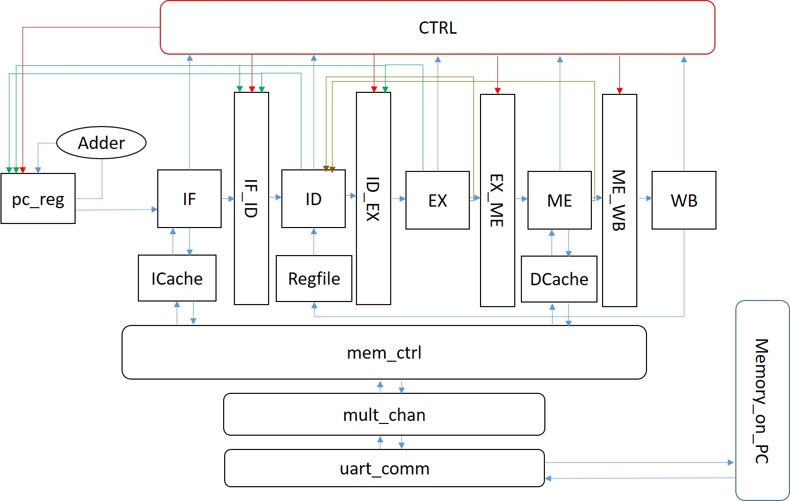
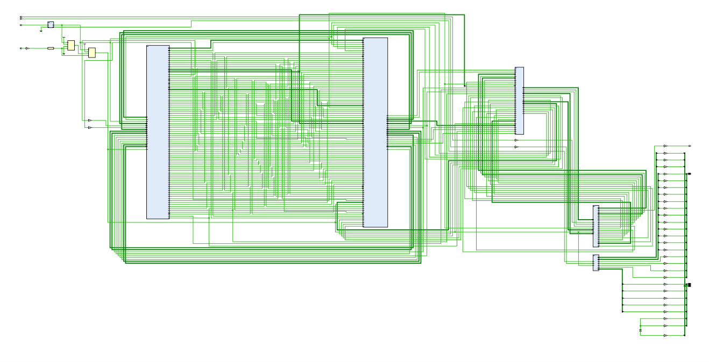

# RISCV-CPU

This project is a FPGA supported RISC-V CPU with 5-stage pipeline implemented in Verilog HDL, a course project of Computer Architecture(MS108), ACM honor class @ SJTU.

Copyright (c) 2017 Zhanghao Wu

## Abstract

This project is a simple five stage pipelined cpu for risc-v (rv32i) written in verilog HDL. 

It has features as follows:

1. It can behave correctly for the instructions in rv32i, except ECALL, EBREAK, CSRRW, CSRRS, CSRRC, CSRRWI, CSRRSI, CSRRCI

1. It can generate a CPU on FPGA, simulate a memory on PC, and connect two of them by using uart.

1. It has exciting light and status indicator. RGB!!!

## Introduction

The design of this cpu is based on the standard mips five stage pipeline. And the cache and UART is based on the repo of Zhekai Zhang.

The Data flow of the CPU is shown below:
	

### Five stge pipline

The pipeline is similar to the standard mips five stage pipeline with forwardings. For more information, you can read the [Reference [1]](#ref1).

### Forwarding

Just as the graph above shows, each stage after ID has a wire connecting to it, to forward the data back. And in this design, ID stage can get the data in the same cpu cycle.

### Jumps and Branches

To get a better trade off of jumps and the clock rate, I tried a lot methods. And my work can be divided into 2 stages, no-memory-delay and great-memory-delay.

1. In my design, there are some wires from ID and EX to pc_reg and mid stage -- IF_ID and ID_EX, in order to set new address and clear the former instruction ( precise interrupt ).
	- no-memory-delay: PC_reg and mid stage update their status as soon as the signal reach, which works well when the IF stage never stall.
	- great-memory-delay: In this case the pc_reg and mid stages are disgned as state machine, when they get a signal for jump, they get into another state to save the signal.

2. I add switches for *ID_BRANCHES* and *ID_JALR*, indicating that the in which state the branches and jalr should be executed.
	- Firstly, the JAL can be safely executed at ID stage. And the other branches and jumps can be set at ID stage, when the IF stage will never stall.
	- However, as the branch instruction needs data from regeisters which may be forwarded from the stage after ID. Comparation and addition will make ID take more time, and that can be a bottle neck that make the CPU clock rate much slower.
	- Another reason I put the all of the execution of branches, execpt jal, to EX stage is that, when the IF and ME should stall for some cycles, and the pc_reg and mid stage should save the signal. The time for ID to get the forwarding data will be much longer, ID may give wrong branch signal before the needed data reach.
	- Further more, when the branches are set in EX, we can use branch prediction in ID, to speed up our pipeline (uncompleted).

	PS: Branches in EX, without branch prediction can be regarded as always predict not jump, when the instruction is recogonized by ID.

### IF and ME

The logic to wait data to be ready can be quite hard to implement in hardware, as sequential logic is needed in ME. I have tried to make the store instruction just go through the ME stage. If another memory instruction arrive, it wait the cache to be not busy and start its own work. However, my first design will generate latches, which are strongly not recommanded. ( [Reference [3]](#ref3) )

As the cache will give a done signal when the data is ready and the signal only last for one cycle, the logical to wait for the cache to be done can be quite simple and amazing. ( In IF.v and ME.v you can see the code ). In this case, I tried to make store not stall in ME, but the cache will give me a done signal, when the memory access finished, and that will make the logic wrong if another memory instruction come as soon as the memory access done. It can be great to change the cache behavior, in the future.

### Cache and Memory

The cache and memory control of my design is from Zhekai Zhang's design ( [Referece [2]](#ref2) ). And the cache is modified by me to make it able to uncache the address 0x100.

The cpp sources are written in order to simulate the memory behavior, which inter-act with the CPU by UART.

### Makefile for test generation

I write a makefile for make, which can make both .s and .cpp/.c files by using the riscv-tool-chain. The guidance for using it is in [Makefile for risc v tool chain](https://gist.github.com/Michaelvll/46e069e29a8448326acadd7bb2bb1654).

### Some details

1. The imm in sltiu command is signed extended, and unsigned compared.

1. The aluop is firstly numbered by the opcode+funct3+(funct7?), then it is renumbered by the sequence: 0x1,0x2,..., to make the number shorter for better performance.

## Reference

1. 《自己动手写CPU》雷思磊
1. [A Mips CPU written in verilog by sxtyzhangzk](https://github.com/sxtyzhangzk/mips-cpu.git)
1. [Always@](www-inst.eecs.berkeley.edu/~cs150/sp13/resources/Always.pdf)
1. [A MIPS CPU written in Verilog by jmahler](https://github.com/jmahler/mips-cpu.git)

## Appendix

### A. Figures of the CPU

1. CPU circuit diagram

	

2. CPU running on fpga

	

### B. Suppoted commands

| Command | Support |
|---------|---------|
| LUI     | [O]     |
| AUIPC   | [O]     |
| JAL     | [O]     |
| JALR    | [O]     |
| BEQ     | [O]     |
| BNE     | [O]     |
| BLT     | [O]     |
| BGE     | [O]     |
| BLTU    | [O]     |
| BGEU    | [O]     |
| LB      | [O]     |
| LH      | [O]     |
| LW      | [O]     |
| LBU     | [O]     |
| LHU     | [O]     |
| SB      | [O]     |
| SH      | [O]     |
| SW      | [O]     |
| ADDI    | [O]     |
| SLTI    | [O]     |
| SLTIU   | [O]     |
| XORI    | [O]     |
| ORI     | [O]     |
| ANDI    | [O]     |
| SLLI    | [O]     |
| SRLI    | [O]     |
| SRAI    | [O]     |
| ADD     | [O]     |
| SUB     | [O]     |
| SLL     | [O]     |
| SLT     | [O]     |
| SLTU    | [O]     |
| XOR     | [O]     |
| SRL     | [O]     |
| SRA     | [O]     |
| OR      | [O]     |
| AND     | [O]     |
| Fence   | [X]     |
| Fence.I | [X]     |
| ECALL   | [X]     |
| EBREAK  | [X]     |
| CSRRW   | [X]     |
| CSRRS   | [X]     |
| CSRRC   | [X]     |
| CSRRWI  | [X]     |
| CSRRSI  | [X]     |
| CSRRCI  | [X]     |
